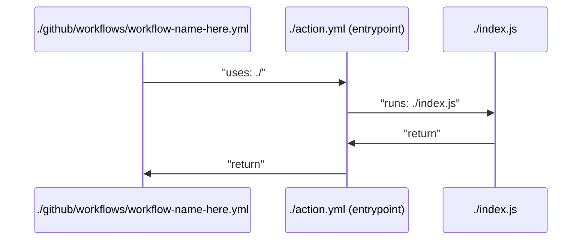

# Test Plans

A good test plan is super important, so here's the plan.

## Things to test, and where to test them

- Config file parsing, this can be done in a regular Jest test.
- Schema validation for the config files generated, this can only be done in a GitHub Action.
- Communication of various fields out to Datadog, this can be done both locally as well as in an Action.

## Config file parsing

- [x] Test that the config file is parsed correctly, including the nested YAML in the nested-strings
- [x] Verify that fields are correctly parsed into the correct types

## Schema validation

For this we're going to have three data files that we'll experiment with:

- Invalid config
- Minimal config
- Maximal config

- [x] Test that the data parsed from various config files matches the schema

## Communication of various fields out to Datadog

These are tests I'd like to add, but they need more thought still. I'm mostly leaving this in the documentation so that if someone else comes up with a new idea, they can add it here. It'll also remind me to check back later.

- [ ] Test that the data is correctly sent to Datadog
- [ ] Test that the data is correctly sent to Datadog with case and special characters accounted for

## How I'm testing in GitHub Actions

This is the normal flow of the GitHub Actions:

This is great, because it tells us where we can put shims. The first and most obvious place to place the shim is to just add more actions in a different folder.

In order to test this module, I'm going to use a mock for `@actions/core` so that I can evaluate the parameters that we're running. This isn't perfect test coverage, but we're not going for perfect, we're going for reliable. At least for now, this is a great start.

## Org Rules File

- [x] Verify that the org rules file can be obtained successfully using `GITHUB_TOKEN` in the `.github` repo.
- [x] Verify that we can handle a missing file scenario.
- [x] Test that the org rules file is parsed correctly
- [x] Test that the org rules file causes a predictable failure if parsing fails
- [x] Verify that selection works properly with `all` as the selector.
- [x] Verify that selection works properly with selector criteria.
- [x] Verify that `tags` requirements are enforced
- [x] Verify that `links` enforcement works
- [x] Verify that `docs` enforcement works
- [x] Verify that `contacts` enforcement works
- [x] Verify that `repos` enforcement works
- [x] Verify that `integrations` enforcement works
