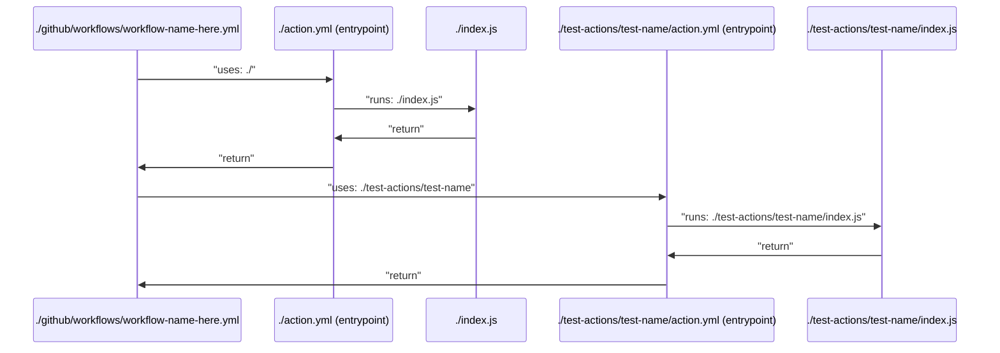

# Test Plans

A good test plan is super important, so here's the plan.

## Things to test, and where to test them

- Config file parsing, this can be done in a regular Jest test.
- Schema validation for the config files generated, this can only be done in a GitHub Action.
- Communication of various fields out to Datadog, this can be done both locally as well as in an Action.

## Config file parsing

- [x] Test that the config file is parsed correctly, including the nested YAML in the nested-strings
- [x] Verify that fields are correctly parsed into the correct types

## Schema validation

For this we're going to have three data files that we'll experiment with:

- Invalid config
- Minimal config
- Maximal config

- [ ] Test that the data parsed from various config files matches the schema

## Communication of various fields out to Datadog

- [ ] Test that the data is correctly sent to Datadog
- [ ] Test that the data is correctly sent to Datadog with case and special characters accounted for

## How I'm testing in GitHub Actions

This is the normal flow of the GitHub Actions:

This is great, because it tells us where we can put shims. The first and most obvious place to place the shim is to just add more actions in a different folder.

The way I will run the test on the output of the primary action, `./action.yml`, is by using a hidden `write-test-data` input which causes all properties to be written to a `./test-data.json` file. This file will be read by the test action, `./test-actions/test-name/action.yml`, and then the test action will run the tests.

**It's important to note that for security, all of the inputs to the primary action which could contain sensitive information will be redacted from the `./test-data.json` file, and the inputs from other actions will be omitted completely.**
